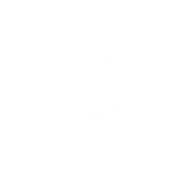

<div align="center">
  
</div>  

# ⚡Hypertrophic - Ecommerce de Suplementos Deportivos

**Hypertrophic** es un **ecommerce moderno, rápido y escalable**, especializado en la venta de suplementos deportivos.
Integra tecnologías de vanguardia para brindar una **experiencia de compra optimizada**, con diseño atractivo, confianza en el proceso y automatización gracias al uso de **Firebase Cloud Functions**.

Los clientes pueden navegar productos, leer testimonios, pagar con total seguridad a través de **Wompi** y recibir una experiencia fluida, ya sea desde desktop o móvil.

---

## 🚀 Tecnologías utilizadas

### **Frontend**

* **Next.js 14 (App Router)** → Framework de React con renderizado híbrido (SSR/ISR) para SEO y performance.
* **React 18** → Librería base para interfaces interactivas.
* **Tailwind CSS** → Estilos utilitarios, diseño moderno y responsivo.
* **Lucide React** → Íconos minimalistas y elegantes.
* **Embla Carousel** → Carrusel ligero y accesible para productos y testimonios.
* **Google Fonts con `next/font`** → Fuentes personalizadas: *Koulen*, *Montserrat*, *Roboto*.
* **TypeScript** → Tipado estático para mayor robustez en desarrollo.

### **Backend & Infraestructura**

* **Firebase Cloud Functions** → Lógica serverless para procesar operaciones.
* **Firebase Hosting** → Despliegue rápido, seguro y escalable.
* **Firebase Firestore** → Base de datos NoSQL en tiempo real para productos, pedidos y clientes.

### **Pagos**

* **Wompi** → Pasarela de pagos segura y confiable para el mercado colombiano.

---

## 📄 Características principales

* 🛒 **Catálogo dinámico** de productos y combos fitness.
* 💳 **Pagos seguros con Wompi**.
* ⚡ **Arquitectura serverless con Firebase Functions**.
* 📱 **Diseño mobile-first y responsivo**.
* 🐘 **Identidad de marca sólida**, con testimonios y CTA directos a WhatsApp.
* 🔒 **Escalable y confiable** para crecer con la demanda.

---

## 🏗️ Arquitectura del proyecto

```plaintext
hypertrophic/
├── app/                 # Páginas y rutas de Next.js (App Router)
├── components/          # Componentes reutilizables (UI, layouts, etc.)
├── public/              # Archivos estáticos (logo, imágenes, fuentes locales)
├── styles/              # Estilos globales con Tailwind
├── firebase/            # Configuración y funciones de Firebase
├── utils/               # Utilidades y helpers
└── README.md            # Documentación del proyecto
```

---

## 🧪 Primeros pasos para desarrollo

Clona el repositorio:

```bash
git clone https://github.com/usuario/hypertrophic.git
cd hypertrophic
```

Instala las dependencias:

```bash
npm install
# o
yarn install
# o
pnpm install
# o
bun install
```

Ejecuta el servidor de desarrollo:

```bash
npm run dev
# o
yarn dev
# o
pnpm dev
# o
bun dev
```

Accede en: [http://localhost:3000](http://localhost:3000) 🚀

---

## 📦 Despliegue

Este proyecto está preparado para despliegue en:

* **Firebase Hosting** (recomendado, integrado con Functions).
* **Vercel** (ideal para Next.js).

---

## 📜 Licencia

Este proyecto está bajo la licencia **MIT**.
Puedes usarlo, modificarlo y distribuirlo libremente, siempre que se mantenga el crédito a los autores originales.

---

⚡ **Hypertrophic** no es solo un ecommerce, es una experiencia fitness digital:
unimos tecnología + comunidad + suplementos originales para llevar tus entrenamientos al siguiente nivel.

---

👉 ¿Quieres que además te arme un **roadmap de features futuras** (chatbot con IA, app móvil, programa de recompensas gamificado) para incluirlo al final del README como visión a largo plazo?
